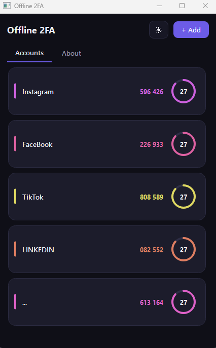

<div align="center">

<br/>
<b><i>A Norac Project</i></b>
<br/>

<br />
<br/><br/>

<br/><br/>
<br/>
<p>
 
 
 
 
 
</p>
<br/><br/>
</div>

Your 2FA codes, on your desktop, fully offline. Paste your secret, get your code. That's the whole app.

## 💡 Why this exists

Here's a scene you've lived through. A website wants your 2FA code, your phone is charging in another room, and you find yourself googling "2fa code generator online" and pasting your secret key into some random site like 2fa.live.

Stop for a second. That secret key is your second factor. Typing it into a website you know nothing about hands the keys to a stranger and quietly undoes the entire reason you turned on 2FA.

Offline 2FA does the same job, minus the stranger. Paste your secret once, get a fresh code every 30 seconds, forever. No website, no server, no account, no internet. It runs on your machine and stays there.

## 🪄 Dead simple on purpose

Other authenticator apps bury you in dropdowns — algorithm, digits, period, counter type. Offline 2FA doesn't ask any of that. You paste the secret, you get the code. Done.

The clever bit: almost every service on earth uses the same standard settings, so there's nothing to configure. And for the rare service that's different, it hands you a setup link or QR code that already contains its settings — Offline 2FA reads those automatically. Either way, you never touch a single option.

## 🎯 What you get

- ⚡ **One-box setup** — paste a secret key or an `otpauth://` link, hit Add, you're done
- 📷 **QR import** — got a QR code screenshot instead? Drop the image in and it reads it
- 🔄 **Auto-refresh** — codes roll over every 30 seconds, smooth, no flicker, no lag
- 📋 **Click to copy** — tap any card, the code's on your clipboard
- 🎨 **Not another gray utility** — each account gets its own color, a live countdown ring, and clean type. Dark mode by default, light mode one click away
- 🔒 **Truly offline** — there is no network code in this project. Nothing to leak, nothing to trust
- 🧠 **Handles the weird ones** — 8-digit codes, alternate hash algorithms, odd time steps: all supported automatically when a service needs them, invisible when it doesn't

## ⬇️ Download Offline2FA

Just want to use Offline2FA? Download the ready-to-run Windows app — no Python, installation, or setup required.

**[Download Offline2FA.exe](https://github.com/Norac-projects/Offline2FA/releases/latest)**  
Windows • Latest release

### How to run
- Click **Download Offline2FA.exe** above.
- Double-click `Offline2FA.exe` to launch.
- Add your 2FA accounts by pasting a secret key, an `otpauth://` link, or dragging and dropping a screenshot of your setup QR code.
- Click any account card to instantly copy the fresh code to your clipboard!

💡 **Data Backup Tip:** Because this app is 100% offline, your accounts are saved locally on your PC (`%APPDATA%\Offline2FA\accounts.json`). Be sure to back up this file if you plan to format your computer!

🍎 Using macOS or 🐧 Linux? The `.exe` is Windows-only. See the **Quick Start** section below for running Offline2FA from source.

⚠️ **Windows SmartScreen**  
Offline2FA is currently unsigned, so Windows may show "Windows protected your PC." If this appears, click **More info** → **Run anyway**. The app is fully open-source and never connects to the internet.

### 🧑‍💻 Developers
Want to build Offline2FA from source, contribute, or explore the project internals?

Skip the `.exe` and continue to **Quick Start** and **Project Layout**.

## 🚀 Quick start

```bash
git clone https://github.com/Norac-projects/Offline2FA.git
cd Offline2FA
pip install -r requirements.txt
python main.py
```

That's it — one file, one command. Requires **Python 3.13**.

Never touched Python before? Follow [THE_POTATO_PROTOCOL.md](THE_POTATO_PROTOCOL.md) — every step spelled out, zero assumptions.

## 📦 Building a standalone .exe (Windows)

No Python required for the people you send it to:

```bash
pip install -r requirements.txt
pyinstaller Offline2FA.spec
```

Grab `dist/Offline2FA.exe` — single file, double-click, done. No Python, no installer, no dependencies on the target machine.

## 💾 Where your data lives

Accounts are saved in a plain JSON file in your own user folder:

| OS | Location |
| --- | --- |
| Windows | `%APPDATA%\Offline2FA\accounts.json` |
| macOS | `~/Library/Application Support/Offline2FA/` |
| Linux | `~/.config/Offline2FA/` |

It never leaves your machine unless you move it. It's your only copy, so **back it up somewhere safe**.

## 💻 Languages

| Language | Share |
| --- | --- |
| 🐍 Python | 100% |

Pure Python 3.13 front to back — the UI styling is Qt stylesheets embedded in Python, so GitHub's language bar shows a clean 100% Python.

## 🧱 Built with

| Library | Used for | License |
| --- | --- | --- |
| PySide6 (Qt) | the interface | LGPL-3.0 |
| zxing-cpp | reading QR code images | Apache-2.0 |
| Pillow | opening image files | MIT-CMU (HPND) |
| PyInstaller | building the .exe | GPL-2.0 w/ bootloader exception |

All four are safe to use and share in an open-source project. PySide6 is dynamically linked (LGPL-compliant), zxing-cpp and Pillow are permissive, and PyInstaller is only a build tool — it's never bundled into the app, and its bootloader exception explicitly permits distributing the resulting executables under any license.

The 2FA code generation itself uses only the Python standard library (`hmac`, `hashlib`, `struct`, `base64`) — no crypto dependency to trust or audit. It follows the published standards RFC 6238 (time-based) and RFC 4226 (counter-based), and the implementation is verified against the official test vectors in those RFCs.

## 📂 Project layout

```text
Offline2FA/
├── main.py              # entry point — run this
├── Offline2FA.spec      # PyInstaller build recipe
├── requirements.txt
└── src/offline2fa/
    ├── otp.py           # the code generator (RFC 6238 / 4226)
    ├── uri.py           # reads otpauth:// links and raw secrets
    ├── qr.py            # QR image import
    ├── storage.py       # local JSON persistence
    ├── colors.py        # per-account accent colors
    └── ui/              # window, cards, add dialog, About, theming
```

## ⚙️ Requirements

- 🐍 Python 3.13
- 🖥️ Windows 10/11, macOS, or any modern Linux
- 🔌 Fully offline — no network code, no account, no internet required

## 📬 Reach Me

<p align="center">
 <a href="[your-instagram-link]">  </a>
 <a href="[your-telegram-link]">  </a>
 <a href="[your-reddit-link]">  </a>
 <a href="mailto:[your-email]">  </a>
</p>

<div align="center">

| Platform | Handle |
| --- | --- |
| ✉️ Email | Norac-Projects@Proton.me |
| ✈️ Telegram | @NoracProjects |
| 📷 Instagram | @NoracProjects |
| 🟠 Reddit | u/Norac-Projects |

</div>

## 🤝 Let's Collaborate

I'm always up for teaming up on desktop tooling, industrial/OT software,
embedded systems, Raspberry Pi projects, or anything privacy-first. If
you've got an idea, a gap you've noticed in the tooling world, or just want
to build something that doesn't need a cloud subscription to function — open
an issue, send a message, or just say hi.

## ☕ Support the Work

If one of these tools saved you an afternoon (or a server), you're welcome to
buy me a coffee — entirely optional, always appreciated, never expected.

<div align="center">

₿ Bitcoin (BTC):
`1Ka1cNmfhbNej9iiLzvfVzYqEZh2e1vbNk`

</div>

## 📜 License

MIT — see [LICENSE](LICENSE). Use it, fork it, ship it.

Part of Norac Projects.

<p align="center">
<i>Built because your second factor should never leave your machine.</i>
</p>
